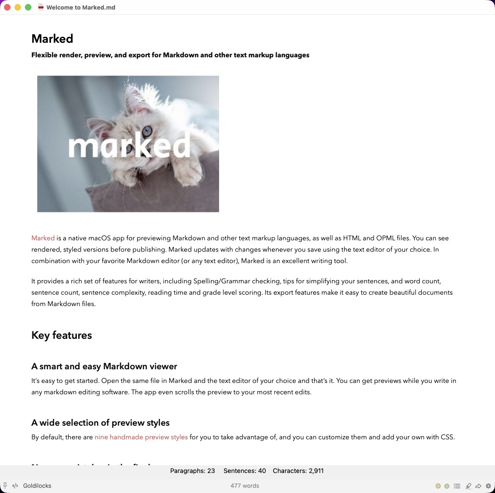

# <%= @title %>

By opening , Marked receives live updates over a named pasteboard instead of watching a file on disk. The source app must integrate with Marked.

[Curio](Curio.html), [Drafts](Drafts.html), and [The Archive](The_Archive.html) document their own toggles and menu commands. nvUltra, nvALT, Bear, and others use the same channel: open streaming preview in Marked, enable integration in your editor, and start typing; updates arrive in near real time.

## Developers

To integrate the Streaming Preview with your app, you just need to put the markdown text to preview on a named clipboard. Use the following code (Objective-C) to update, preferably on a didEndEditing method or at throttled intervals:

```obj-c
NSString *rawString = @"the text to process";
// pasteboard *must* be named 'mkStreamingPreview'
NSPasteboard* pb = [NSPasteboard pasteboardWithName:@"mkStreamingPreview"];
[pb clearContents];
[pb setString:rawString forType:(NSString*)kUTTypeUTF8PlainText];
```

### Declaring a Base URL for relative assets

You can also provide a base url for the streaming preview, allowing relative URLs in images and other assets to function as they would in the source app. If the base URL includes a filename, its name and extension will be made available to custom processors, but it's not required to do so. To include the base URL, simply put an NSURL object into the clipboard:

```obj-c
NSString *rawString = @"The text to be processed\\n\\n";
NSURL *baseURL = [NSURL fileURLWithPath:@"/Users/username/Documents/HelpDocs/Main Window.md"];
NSPasteboard* pb = [NSPasteboard pasteboardWithName:@"mkStreamingPreview"];
[pb clearContents];
[pb writeObjects:@[rawString, baseURL]];
```

Or in Swift:

```swift
let rawString = "The text to be processed\n\n"
let baseURL = URL(fileURLWithPath: "/Users/username/Documents/HelpDocs/Main Window.md")
let pb = NSPasteboard(name: "mkStreamingPreview")
pb.clearContents()
pb.writeObjects([rawString, baseURL])
```

If the Mac App Store version of Marked is being used and the baseURL isn't accessible via sandboxing, permission will be requested the first time the URL is loaded in the preview.

### Declaring the Source Application

Apps can also declare themselves as the source of the preview content by including a `source` metadata line. This will usually be accomplished within an HTML comment to allow compatibility with both GFM and MultiMarkdown processors. Simply state the app's name or bundle id:

```html
<!--
source: Bear.app
-->
```

### Opening the Streaming Preview Programatically

Your app can open the Streaming Preview programmatically using the `x-marked-3://stream/` url handler method. This method also accepts an `x-success` parameter in which you can pass a bundle ID of an app to activate upon completion.
