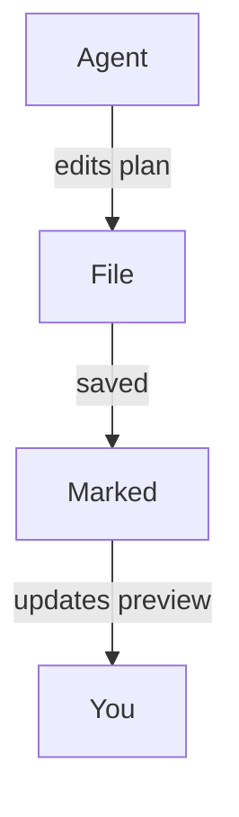

#
# <%= @title %>

Marked is a great companion for modern "agentic coding" workflows where AI tools generate plans, refactor code, and keep updating documentation as you work. By letting Marked watch your project or planning folders, you get a live, readable view of whatever your coding agents touch next, without having to hunt through your editor or file tree.

## Watching your project or plan folder

Instead of opening a single file, you can point Marked at an entire folder that you use for plans, scratch notes, or AI-generated documentation:

- Keep a dedicated "plans" or "notes" folder in your project.
- Configure your coding agent (or yourself) to save design docs, task breakdowns, and status notes there.
- Open that folder in Marked.

Once Marked is watching a folder, it will automatically display the **most recently modified file**. As your agent creates or updates Markdown files --- whether that's a fresh implementation plan or an updated progress log --- Marked switches to the new or changed document and refreshes the preview instantly.

This works especially well with agentic tools like Cursor, Claude, and Copilot that continuously regenerate specs, to‑do lists, or architecture notes while you iterate on a feature.

## Scrolling to the first change

When *Scroll to Edit* is enabled in Marked's preferences, the preview doesn't just reload --- it **scrolls directly to the first changed area** of the file when it updates.

That means you can:

- Let your AI assistant rewrite sections of a plan or design document.
- Watch Marked reload the file as soon as it's saved.
- Land automatically near the first modified lines, instead of manually searching for what changed.

Combined with folder watching, this makes it easy to see exactly what your agents are doing to your documents, even when they're making frequent, incremental edits.

## Diagrams with Mermaid.js

Marked also has **Mermaid.js support enabled by default**, so sequence diagrams, flowcharts, and architecture diagrams that your agents generate using Mermaid code blocks will render cleanly in the preview. When your AI assistant outputs fenced code like:

````

````

Marked will automatically turn it into a styled, interactive diagram, giving you a visual view of complex workflows, data flows, or system designs created by tools like Cursor, Claude, Copilot, and other agentic coding assistants.

## Example agentic coding workflows

- **Cursor + Marked**: Keep a `plans/` or `notes/` folder in your repo where Cursor writes step‑by‑step implementation plans. Point Marked at that folder to always see the latest plan, rendered cleanly, as you accept and apply edits in the editor.

- **Claude + Marked**: Use Claude to generate design documents, ADRs, and refactoring plans in a shared project folder. Marked automatically opens the newest Markdown output so you can read and annotate it like a living spec.

- **Copilot and other AI coding assistants + Marked**: Whether you're using GitHub Copilot, Copilot Workspace, ChatGPT, or other agentic tools that write Markdown, saving their output into a watched folder gives you an always‑up‑to‑date, high‑quality preview in Marked.

By combining folder watching with *Scroll to Edit*, Marked turns AI‑generated plans and notes into a fast, readable control center for your coding sessions — especially when you lean on agentic workflows and continuous assistance from tools like Cursor, Claude, and Copilot.

