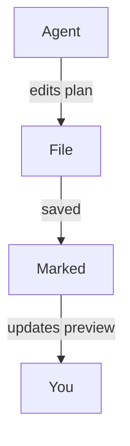

#
# <%= @title %>

Marked ist eine ideale Ergänzung für moderne Workflows mit Coding-Agenten, in denen KI-Werkzeuge Pläne erstellen, Code umgestalten und die Dokumentation fortlaufend aktualisieren. Lassen Sie Marked Ihre Projekt- oder Planungsordner überwachen, erhalten Sie eine aktuelle, gut lesbare Ansicht aller Dateien, an denen Ihre Coding-Agenten arbeiten – ohne sie im Editor oder Dateibaum suchen zu müssen.

## Projekt- oder Planungsordner überwachen [watching-your-project-or-plan-folder]

Anstatt eine einzelne Datei zu öffnen, können Sie Marked auf einen gesamten Ordner verweisen, den Sie für Pläne, Notizen oder KI-generierte Dokumentation verwenden:

- Legen Sie in Ihrem Projekt einen eigenen Ordner `plans` oder `notes` an.
- Konfigurieren Sie Ihren Coding-Agenten (oder Ihren eigenen Arbeitsablauf) so, dass Designdokumente, Aufgabenbeschreibungen und Statusnotizen dort gespeichert werden.
- Öffnen Sie diesen Ordner in Marked.

Sobald Marked einen Ordner überwacht, wird automatisch die **zuletzt geänderte Datei** angezeigt. Während Ihr Agent Markdown-Dateien erstellt oder aktualisiert – unabhängig davon, ob es sich um einen neuen Implementierungsplan oder ein aktualisiertes Fortschrittsprotokoll handelt – wechselt Marked zum neuen oder geänderten Dokument und aktualisiert die Vorschau sofort.

Das funktioniert besonders gut mit agentischen Werkzeugen wie Cursor, Claude und Copilot, die Spezifikationen, Aufgabenlisten oder Architekturnotizen während der Arbeit an einer Funktion fortlaufend neu erstellen.

## Scrollen zur ersten Änderung [scrolling-to-the-first-change]

Wenn in den Einstellungen von Marked *Zum Bearbeiten scrollen* aktiviert ist, lädt die Vorschau nicht nur neu, sondern **scrollt direkt zum ersten geänderten Bereich** der Datei.

Damit können Sie:

- Abschnitte eines Plans oder Designdokuments von Ihrem KI-Assistenten überarbeiten lassen,
- beobachten, wie Marked die Datei unmittelbar nach dem Speichern neu lädt, und
- automatisch zu den ersten geänderten Zeilen springen, statt manuell nach den Änderungen zu suchen.

In Kombination mit der Ordnerüberwachung sehen Sie so genau, was Ihre Agenten an den Dokumenten ändern – auch bei häufigen, schrittweisen Anpassungen.

## Diagramme mit Mermaid.js [diagrams-with-mermaidjs]

In Marked ist außerdem die **Mermaid.js-Unterstützung standardmäßig aktiviert**. Sequenz-, Fluss- und Architekturdiagramme, die Ihre Agenten in Mermaid-Codeblöcken erzeugen, werden daher sauber in der Vorschau gerendert. Gibt Ihr KI-Assistent einen Codeblock wie diesen aus:

````

````

wandelt Marked ihn automatisch in ein gestaltetes, interaktives Diagramm um. So erhalten Sie eine visuelle Darstellung komplexer Arbeitsabläufe, Datenflüsse oder Systementwürfe, die mit Cursor, Claude, Copilot oder anderen Coding-Agenten erstellt wurden.

## Beispiele für agentische Coding-Workflows [example-agentic-coding-workflows]

- **Cursor + Marked**: Verwenden Sie in Ihrem Repository einen Ordner `plans/` oder `notes/`, in den Cursor schrittweise Implementierungspläne schreibt. Lassen Sie Marked diesen Ordner überwachen, damit Sie immer den neuesten, sauber gerenderten Plan sehen, während Sie Änderungen im Editor annehmen und anwenden.

- **Claude + Marked**: Lassen Sie Claude Designdokumente, ADRs und Refactoring-Pläne in einem gemeinsamen Projektordner erstellen. Marked öffnet automatisch die neueste Markdown-Ausgabe, sodass Sie sie wie eine fortlaufend aktualisierte Spezifikation lesen und mit Anmerkungen versehen können.

- **Copilot und andere KI-Coding-Assistenten + Marked**: Ob Sie GitHub Copilot, Copilot Workspace, ChatGPT oder andere agentische Werkzeuge verwenden, die Markdown schreiben – speichern diese ihre Ausgabe in einem überwachten Ordner, zeigt Marked stets eine aktuelle, hochwertige Vorschau.

Durch die Kombination der Ordnerüberwachung mit *Zum Bearbeiten scrollen* macht Marked KI-generierte Pläne und Notizen zu einer schnellen, übersichtlichen Schaltzentrale für Ihre Coding-Sitzungen – besonders bei agentischen Workflows und fortlaufender Unterstützung durch Werkzeuge wie Cursor, Claude und Copilot.

