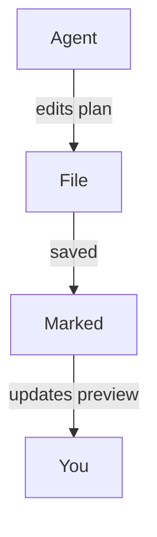

<!-- MT-DRAFT: machine translation; human review required -->

#
# <%= @title %>

Marked es un excelente compañero para los flujos de trabajo modernos de "codificación agente" donde las herramientas de inteligencia artificial generan planes, refactorizan el código y siguen actualizando la documentación mientras trabaja. Al permitir que Marked observe su proyecto o carpetas de planificación, obtendrá una vista en vivo y legible de lo que sus agentes de codificación toquen a continuación, sin tener que buscar en su editor o árbol de archivos.

## Observando la carpeta de su proyecto o plan

En lugar de abrir un solo archivo, puede señalar Marcado en una carpeta completa que usa para planos, notas preliminares o documentación generada por IA:

- Mantenga una carpeta dedicada a "planes" o "notas" en su proyecto.
- Configure su agente de codificación (o usted mismo) para guardar allí documentos de diseño, desgloses de tareas y notas de estado.
- Abre esa carpeta en Marcados.

Una vez que Marked esté observando una carpeta, mostrará automáticamente el **archivo modificado más recientemente**. A medida que su agente crea o actualiza archivos Markdown, ya sea un nuevo plan de implementación o un registro de progreso actualizado, Marked cambia al documento nuevo o modificado y actualiza la vista previa al instante.

Esto funciona especialmente bien con herramientas agentes como Cursor, Claude y Copilot que regeneran continuamente especificaciones, listas de tareas pendientes o notas de arquitectura mientras itera sobre una característica.

## Desplazarse hasta el primer cambio

Cuando *Desplazarse para editar* está habilitado en las preferencias de Marked, la vista previa no solo se recarga, sino que **se desplaza directamente a la primera área modificada** del archivo cuando se actualiza.

Eso significa que puedes:

- Deje que su asistente de IA reescriba secciones de un plan o documento de diseño.
- Mira a Marked recargar el archivo tan pronto como se guarda.
- Aterriza automáticamente cerca de las primeras líneas modificadas, en lugar de buscar manualmente lo que cambió.

Combinado con la supervisión de carpetas, esto facilita ver exactamente qué están haciendo sus agentes con sus documentos, incluso cuando realizan ediciones incrementales y frecuentes.

## Diagramas con Mermaid.js

Marked también tiene **compatibilidad con Mermaid.js habilitada de forma predeterminada**, por lo que los diagramas de secuencia, diagramas de flujo y diagramas de arquitectura que sus agentes generan usando bloques de código de Mermaid se representarán limpiamente en la vista previa. Cuando su asistente de IA genera código vallado como:

````

````

Marked lo convertirá automáticamente en un diagrama interactivo con estilo, brindándole una vista visual de flujos de trabajo complejos, flujos de datos o diseños de sistemas creados por herramientas como Cursor, Claude, Copilot y otros asistentes de codificación agentes.

## Ejemplos de flujos de trabajo de codificación agente

- **Cursor + Marcado**: mantenga una carpeta `plans/` o `notes/` en su repositorio donde Cursor escribe planes de implementación paso a paso. Apunte Marcado en esa carpeta para ver siempre el plan más reciente, renderizado de forma limpia, a medida que acepta y aplica las ediciones en el editor.

- **Claude + Marked**: utilice Claude para generar documentos de diseño, ADR y planes de refactorización en una carpeta de proyecto compartida. Marked abre automáticamente la salida de Markdown más reciente para que puedas leerla y anotarla como una especificación viva.

- **Copilot y otros asistentes de codificación de IA + Marked**: ya sea que estés usando GitHub Copilot, Copilot Workspace, ChatGPT u otras herramientas de agente que escriben Markdown, guardar su salida en una carpeta supervisada te brinda una vista previa siempre actualizada y de alta calidad en Marked.

Al combinar la visualización de carpetas con *Desplazarse para editar*, Marked convierte los planes y notas generados por IA en un centro de control rápido y legible para sus sesiones de codificación, especialmente cuando se apoya en flujos de trabajo agentes y asistencia continua de herramientas como Cursor, Claude y Copilot.