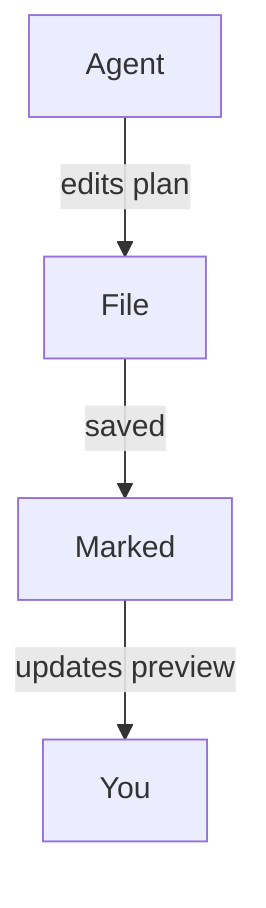

#
# <%= @title %>

Marked est un excellent compagnon pour les flux de travail modernes de « codage agentique », où des outils d'IA génèrent des plans, refactorisent du code et mettent continuellement à jour la documentation pendant que vous travaillez. En laissant Marked surveiller vos dossiers de projet ou de planification, vous obtenez une vue en direct et lisible de tout ce que vos agents de codage modifient, sans avoir à fouiller dans votre éditeur ou votre arborescence de fichiers.

## Surveiller votre dossier de projet ou de plans

Plutôt que d'ouvrir un seul fichier, vous pouvez pointer Marked vers un dossier entier que vous utilisez pour les plans, les notes provisoires, ou la documentation générée par l'IA :

- Conservez un dossier dédié « plans » ou « notes » dans votre projet.
- Configurez votre agent de codage (ou vous-même) pour y enregistrer les documents de conception, les découpages de tâches et les notes d'avancement.
- Ouvrez ce dossier dans Marked.

Une fois que Marked surveille un dossier, il affiche automatiquement le **fichier modifié le plus récemment**. À mesure que votre agent crée ou met à jour des fichiers Markdown, qu'il s'agisse d'un nouveau plan d'implémentation ou d'un journal d'avancement mis à jour, Marked bascule vers le document nouveau ou modifié et actualise instantanément l'aperçu.

Cela fonctionne particulièrement bien avec des outils agentiques comme Cursor, Claude et Copilot, qui régénèrent en continu des spécifications, des listes de tâches ou des notes d'architecture pendant que vous itérez sur une fonctionnalité.

## Défiler jusqu'à la première modification

Lorsque le *défilement vers la modification* est activé dans les préférences de Marked, l'aperçu ne se contente pas de se recharger : il **défile directement jusqu'à la première zone modifiée** du fichier lors de sa mise à jour.

Cela signifie que vous pouvez :

- Laisser votre assistant IA réécrire des sections d'un plan ou d'un document de conception.
- Regarder Marked recharger le fichier dès qu'il est enregistré.
- Vous retrouver automatiquement près des premières lignes modifiées, plutôt que de rechercher manuellement ce qui a changé.

Combinée à la surveillance de dossier, cette fonctionnalité facilite le suivi précis de ce que vos agents font à vos documents, même lorsqu'ils effectuent des modifications fréquentes et incrémentales.

## Diagrammes avec Mermaid.js

Marked dispose également de la **prise en charge de Mermaid.js activée par défaut** : les diagrammes de séquence, organigrammes et diagrammes d'architecture que vos agents génèrent à l'aide de blocs de code Mermaid s'afficheront donc proprement dans l'aperçu. Lorsque votre assistant IA produit un bloc de code délimité tel que :

````

````

Marked le transformera automatiquement en un diagramme stylé et interactif, vous offrant une vue visuelle des flux de travail complexes, des flux de données ou des conceptions système créés par des outils comme Cursor, Claude, Copilot et d'autres assistants de codage agentiques.

## Exemples de flux de travail de codage agentique

- **Cursor + Marked** : conservez un dossier `plans/` ou `notes/` dans votre dépôt, dans lequel Cursor rédige des plans d'implémentation étape par étape. Pointez Marked vers ce dossier pour toujours consulter le dernier plan, proprement mis en forme, à mesure que vous acceptez et appliquez les modifications dans l'éditeur.

- **Claude + Marked** : utilisez Claude pour générer des documents de conception, des ADR et des plans de refactorisation dans un dossier de projet partagé. Marked ouvre automatiquement le dernier fichier Markdown produit, afin que vous puissiez le lire et l'annoter comme une spécification vivante.

- **Copilot et autres assistants de codage IA + Marked** : que vous utilisiez GitHub Copilot, Copilot Workspace, ChatGPT ou d'autres outils agentiques qui écrivent du Markdown, enregistrer leur sortie dans un dossier surveillé vous offre dans Marked un aperçu toujours à jour et de haute qualité.

En combinant la surveillance de dossier avec le *défilement vers la modification*, Marked transforme les plans et notes générés par l'IA en un centre de contrôle rapide et lisible pour vos sessions de code, en particulier lorsque vous vous appuyez sur des flux de travail agentiques et l'assistance continue d'outils comme Cursor, Claude et Copilot.
