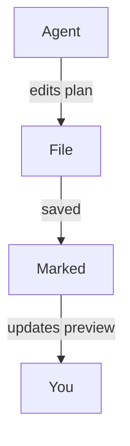

<!-- MT-DRAFT: machine translation; human review required -->

#
# <%= @title %>

A Marked nagyszerű társ a modern „ügynökkódolási” munkafolyamatokhoz, ahol az AI-eszközök terveket generálnak, kódot szerkesztenek, és munka közben folyamatosan frissítik a dokumentációt. Ha hagyja, hogy a Marked figyelje a projektjét vagy a tervezési mappákat, élő, olvasható nézetet kap arról, amit a kódolóügynökei legközelebb érintenek, anélkül, hogy a szerkesztőben vagy a fájlfában kellene keresgélnie.

## A projekt vagy a tervmappa figyelése

Egyetlen fájl megnyitása helyett rámutathat a Marked egy teljes mappára, amelyet tervekhez, jegyzetekhez vagy mesterséges intelligencia által generált dokumentációhoz használ:

- Tartson külön "tervek" vagy "jegyzetek" mappát a projektben.
- Konfigurálja a kódoló ügynököt (vagy magát), hogy oda mentse a tervezési dokumentumokat, a feladatok lebontását és az állapotjegyzeteket.
- Nyissa meg a mappát a Megjelölve.

Ha a Marked egy mappát figyel, automatikusan megjeleníti a **legutóbb módosított fájlt**. Amikor az ügynök létrehozza vagy frissíti a Markdown fájlokat -- legyen szó akár friss megvalósítási tervről, akár frissített folyamatnaplóról --- A Marked átvált az új vagy módosított dokumentumra, és azonnal frissíti az előnézetet.

Ez különösen jól működik az olyan ügynöki eszközökkel, mint a Cursor, Claude és Copilot, amelyek folyamatosan újragenerálják a specifikációkat, a teendők listáját vagy az architektúra megjegyzéseit, miközben Ön egy szolgáltatáson iterál.

## Görgetés az első módosításhoz

Ha a *Görgessen a Szerkesztéshez* engedélyezve van a Marked beállításaiban, az előnézet nem csak újratöltődik -- hanem **közvetlenül a fájl első módosított területére** görgeti a frissítést.

Ez azt jelenti, hogy:

- Hagyja, hogy az AI-asszisztens átírja egy terv vagy tervdokumentum szakaszait.
- Watch Marked újratölti a fájlt, amint az mentésre került.
- Automatikusan landoljon az első módosított vonalak közelében, ahelyett, hogy manuálisan keresné, hogy mi változott.

A mappafigyeléssel kombinálva könnyen láthatja, hogy az ügynökei pontosan mit csinálnak a dokumentumokkal, még akkor is, ha gyakran, fokozatosan szerkesztenek.

## Diagramok a Mermaid.js segítségével

A Marked alapértelmezés szerint engedélyezi a **Mermaid.js támogatását** is, így az ügynökei által Mermaid kódblokkokkal létrehozott szekvencia diagramok, folyamatábrák és architektúra diagramok tisztán jelennek meg az előnézetben. Amikor az AI-asszisztens olyan elkerített kódot ad ki, mint például:

````

````

A Megjelölt automatikusan stílusos, interaktív diagrammá alakítja, így vizuális nézetet nyújt az olyan eszközökkel, mint a Cursor, Claude, Copilot és más ügynöki kódolási asszisztensek által létrehozott összetett munkafolyamatokról, adatfolyamokról vagy rendszertervekről.

## Példa ügynöki kódolási munkafolyamatokra

- **Kurzor + Megjelölt**: Tartson egy `plans/` vagy `notes/` mappát a tárhelyen, ahol a kurzor lépésről lépésre írja a megvalósítási terveket. Pont az adott mappára jelölve, hogy mindig a legújabb tervet lássa tisztán megjelenítve, amikor elfogadja és alkalmazza a szerkesztéseket a szerkesztőben.

- **Claude + Marked**: A Claude segítségével tervezési dokumentumokat, ADR-eket és átalakítási terveket hozhat létre egy megosztott projektmappában. A Markdown automatikusan megnyitja a legújabb Markdown kimenetet, így élő specifikációként olvashatja és megjegyzésekkel látja el.

- **Copilot és más mesterséges intelligencia kódolási asszisztensek + Marked**: Akár GitHub Copilotot, Copilot Workspace-t, ChatGPT-t vagy más, Markdown-t író ügynöki eszközt használ, a kimenetüket egy figyelt mappába mentve mindig naprakész, kiváló minőségű előnézetet kaphat a Marked alkalmazásban.

A mappafigyelés és a *Görgessen a Szerkesztéshez* kombinálásával a Marked a mesterséges intelligencia által generált terveket és jegyzeteket gyors, olvasható vezérlőközponttá alakítja a kódolási munkamenetekhez – különösen akkor, ha az ügynöki munkafolyamatokra és az olyan eszközök folyamatos segítségére támaszkodik, mint a Cursor, Claude és Copilot.