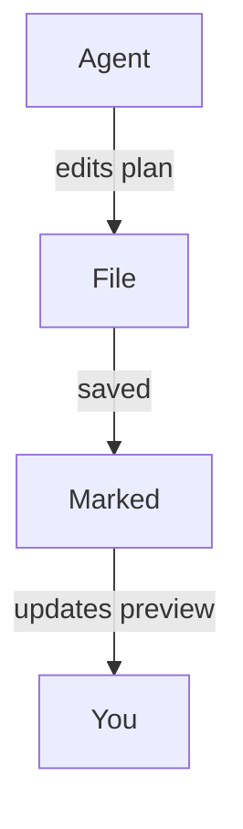

<!-- MT-DRAFT: machine translation; human review required -->

#
# <%= @title %>

Marked è un ottimo compagno per i moderni flussi di lavoro di "codifica agente" in cui gli strumenti di intelligenza artificiale generano piani, effettuano il refactoring del codice e continuano ad aggiornare la documentazione mentre lavori. Lasciando che Marked controlli il tuo progetto o le cartelle di pianificazione, ottieni una visualizzazione live e leggibile di qualunque cosa i tuoi agenti di codifica tocchino successivamente, senza dover cercare nell'editor o nell'albero dei file.

## Guardando la cartella del tuo progetto o del tuo piano

Invece di aprire un singolo file, puoi puntare Marked su un'intera cartella che utilizzi per piani, appunti o documentazione generata dall'intelligenza artificiale:

- Mantieni una cartella dedicata "piani" o "note" nel tuo progetto.
- Configura il tuo agente di codifica (o te stesso) per salvare lì i documenti di progettazione, la suddivisione delle attività e le note sullo stato.
- Apri la cartella in Marked.

Una volta che Marked sta controllando una cartella, visualizzerà automaticamente il **file modificato più recentemente**. Man mano che l'agente crea o aggiorna i file Markdown, che si tratti di un nuovo piano di implementazione o di un registro di avanzamento aggiornato, Marked passa al documento nuovo o modificato e aggiorna immediatamente l'anteprima.

Funziona particolarmente bene con strumenti agenti come Cursor, Claude e Copilot che rigenerano continuamente specifiche, elenchi di cose da fare o note di architettura mentre si esegue l'iterazione di una funzionalità.

## Scorrimento fino alla prima modifica

Quando *Scorri per modificare* è abilitato nelle preferenze di Marked, l'anteprima non si limita a ricaricarsi: **scorre direttamente alla prima area modificata** del file quando si aggiorna.

Ciò significa che puoi:

- Lascia che il tuo assistente AI riscriva le sezioni di un piano o di un documento di progettazione.
- Guarda Marked ricaricare il file non appena viene salvato.
- Atterra automaticamente vicino alle prime linee modificate, invece di cercare manualmente ciò che è cambiato.

In combinazione con la sorveglianza delle cartelle, ciò rende facile vedere esattamente cosa stanno facendo i tuoi agenti sui tuoi documenti, anche quando apportano modifiche frequenti e incrementali.

## Diagrammi con Sirena.js

Marked ha anche il **supporto Sirena.js abilitato per impostazione predefinita**, quindi i diagrammi di sequenza, i diagrammi di flusso e i diagrammi dell'architettura che i tuoi agenti generano utilizzando i blocchi di codice Sirena verranno visualizzati in modo pulito nell'anteprima. Quando il tuo assistente AI genera codice protetto come:

````

````

Marked lo trasformerà automaticamente in un diagramma interattivo con stile, offrendoti una visualizzazione visiva di flussi di lavoro complessi, flussi di dati o progetti di sistemi creati da strumenti come Cursor, Claude, Copilot e altri assistenti di codifica degli agenti.

## Esempio di flussi di lavoro di codifica degli agenti

- **Cursore + Contrassegnato**: mantieni una cartella `plans/` o `notes/` nel repository in cui Cursore scrive i piani di implementazione passo passo. Punto contrassegnato in quella cartella per vedere sempre il piano più recente, reso in modo pulito, mentre accetti e applichi le modifiche nell'editor.

- **Claude + Marked**: utilizza Claude per generare documenti di progettazione, ADR e piani di refactoring in una cartella di progetto condivisa. Marked apre automaticamente l'output Markdown più recente in modo da poterlo leggere e annotare come una specifica vivente.

- **Copilot e altri assistenti di codifica AI + Marked**: che tu stia utilizzando GitHub Copilot, Copilot Workspace, ChatGPT o altri strumenti di agenti che scrivono Markdown, il salvataggio dell'output in una cartella controllata ti offre un'anteprima sempre aggiornata e di alta qualità in Marked.

Combinando la visualizzazione delle cartelle con *Scorri per modificare*, Marked trasforma i piani e le note generati dall'intelligenza artificiale in un centro di controllo veloce e leggibile per le tue sessioni di codifica, soprattutto quando ti affidi a flussi di lavoro agenti e all'assistenza continua di strumenti come Cursor, Claude e Copilot.