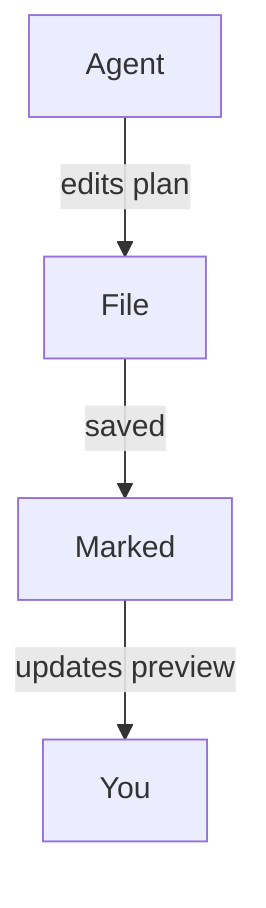

<!-- MT-DRAFT: machine translation; human review required -->

#
# <%= @title %>

Marked は、AI ツールが計画を生成し、コードをリファクタリングし、作業中にドキュメントを更新し続ける最新の「エージェント コーディング」ワークフローの強力なコンパニオンです。 Marked にプロジェクトまたは計画フォルダーを監視させることで、エディターやファイル ツリーを探し回らなくても、コーディング エージェントが次に触れるものすべてをライブで読みやすいビューで確認できます。

## プロジェクトまたは計画フォルダーを監視する

単一のファイルを開く代わりに、計画、スクラッチ メモ、または AI 生成のドキュメントに使用するフォルダー全体をマークすることができます。

- プロジェクト内に専用の「計画」または「メモ」フォルダーを保持します。
- コーディング エージェント (または自分自身) を設定して、設計ドキュメント、タスクの内訳、ステータス メモをそこに保存します。
- マークされたフォルダーを開きます。

Marked がフォルダーを監視すると、**最近変更されたファイル**が自動的に表示されます。エージェントがマークダウン ファイルを作成または更新すると、それが新しい実装計画であっても、更新された進捗ログであっても、マークによって新しいドキュメントまたは変更されたドキュメントに切り替わり、プレビューが即座に更新されます。

これは、機能の反復中に仕様、To-Do リスト、アーキテクチャ ノートを継続的に再生成する Cursor、Claude、Copilot などのエージェント ツールと特にうまく機能します。

## 最初の変更までスクロールします

Marked の環境設定で *編集までスクロール* が有効になっている場合、プレビューはリロードされるだけでなく、更新時に**最初に変更された領域まで直接スクロール**されます。

つまり、次のことが可能になります。

- AI アシスタントに計画書または設計書のセクションを書き直させます。
- マークされたファイルを保存したらすぐに再ロードするのを監視します。
- 何が変更されたかを手動で検索する代わりに、最初に変更された行の近くに自動的に着陸します。

フォルダー監視と組み合わせると、エージェントが頻繁に増分編集を行っている場合でも、ドキュメントに対して何を行っているかを正確に確認することが簡単になります。

## Mermaid.js を使用した図

また、Marked では **Mermaid.js サポートがデフォルトで有効になっています**。そのため、エージェントが Mermaid コード ブロックを使用して生成したシーケンス図、フローチャート、アーキテクチャ図はプレビューできれいにレンダリングされます。 AI アシスタントが次のようなフェンスされたコードを出力すると、

````

````

Marked は、それをスタイル付きのインタラクティブな図に自動的に変換し、Cursor、Claude、Copilot、その他のエージェント コーディング アシスタントなどのツールによって作成された複雑なワークフロー、データ フロー、またはシステム設計を視覚的に表示します。

## エージェントコーディングワークフローの例

- **カーソル + マーク付き**: リポジトリ内に `plans/` または `notes/` フォルダーを保持し、ここに Cursor が段階的な実装計画を書き込みます。ポイント そのフォルダーにマークを付けると、エディターで編集を受け入れて適用する際に、きれいにレンダリングされた最新の計画が常に表示されます。

- **クロード + マーク**: クロードを使用して、共有プロジェクト フォルダーに設計ドキュメント、ADR、およびリファクタリング プランを生成します。 Marked は最新の Markdown 出力を自動的に開くため、生きている仕様のように読み取って注釈を付けることができます。

- **Copilot およびその他の AI コーディング アシスタント + Marked**: GitHub Copilot、Copilot Workspace、ChatGPT、または Markdown を記述するその他のエージェント ツールを使用しているかどうかにかかわらず、その出力を監視フォルダーに保存すると、Marked で常に最新の高品質のプレビューが得られます。

フォルダーの監視と *Scroll to Edit* を組み合わせることで、Marked は、AI が生成した計画とメモを、コーディング セッション用の高速で読みやすいコントロール センターに変えます。特に、エージェントのワークフローや、Cursor、Claude、Copilot などのツールによる継続的な支援を利用している場合に当てはまります。