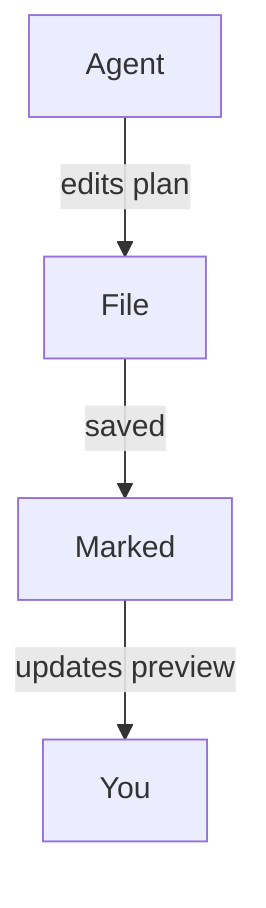

#
# <%= @title %>

Marked is een geweldige aanvulling op moderne 'agentische codering'-workflows waarbij AI-tools plannen genereren, code refactoren en documentatie blijven bijwerken terwijl u werkt. Door Marked uw project- of planningsmappen te laten bekijken, krijgt u een live, leesbaar beeld van alles wat uw codeeragenten vervolgens aanraken, zonder dat u door uw editor of bestandsboom hoeft te zoeken.

## Je project- of planmap bekijken

In plaats van één enkel bestand te openen, kunt u Marked naar een hele map verwijzen die u gebruikt voor plannen, kladnotities of door AI gegenereerde documentatie:

- Bewaar een speciale map "plannen" of "notities" in uw project.
- Configureer uw codeeragent (of uzelf) om ontwerpdocumenten, taakuitsplitsingen en statusnotities daar op te slaan.
- Open die map over Marked.

Zodra Marked een map bekijkt, wordt automatisch het **meest recent gewijzigde bestand** weergegeven. Terwijl uw agent Markdown bestanden maakt of bijwerkt --- of dat nu een nieuw implementatieplan is of een bijgewerkt voortgangslogboek --- schakelt Marked over naar het nieuwe of gewijzigde document en vernieuwt het voorbeeld onmiddellijk.

Dit werkt vooral goed met agentische tools zoals Cursor, Claude en Copilot die voortdurend specificaties, takenlijsten of architectuurnotities genereren terwijl u een functie herhaalt.

## Scrollen naar de eerste wijziging

Wanneer *Scroll naar Bewerken* is ingeschakeld in de voorkeuren van Marked, wordt het voorbeeld niet alleen opnieuw geladen, maar **scrollt het direct naar het eerste gewijzigde gebied** van het bestand wanneer het wordt bijgewerkt.

Dat betekent dat u:

- Laat uw AI-assistent delen van een plan of ontwerpdocument herschrijven.
- Kijk hoe Marked het bestand opnieuw laadt zodra het is opgeslagen.
- Land automatisch in de buurt van de eerste gewijzigde lijnen, in plaats van handmatig te zoeken naar wat er is gewijzigd.

In combinatie met het bewaken van mappen maakt dit het gemakkelijk om precies te zien wat uw agenten met uw documenten doen, zelfs als ze regelmatig incrementele bewerkingen uitvoeren.

## Diagrammen met Mermaid.js

In Marked is ook **Mermaid.js-ondersteuning standaard ingeschakeld**, zodat sequentiediagrammen, stroomdiagrammen en architectuurdiagrammen die uw agenten genereren met behulp van Mermaid-codeblokken, netjes worden weergegeven in de preview. Wanneer uw AI-assistent afgeschermde code uitvoert, zoals:

````

````

Marked verandert het automatisch in een opgemaakt, interactief diagram, waardoor u een visueel beeld krijgt van complexe workflows, gegevensstromen of systeemontwerpen gemaakt door tools als Cursor, Claude, Copilot en andere agentische codeerassistenten.

## Voorbeeld van workflows voor agentische codering

- **Cursor + Marked**: Bewaar een map `plans/` of `notes/` in uw repository waar Cursor stapsgewijze implementatieplannen schrijft. Wijs Marked naar die map om altijd het nieuwste plan te zien, netjes weergegeven, terwijl u bewerkingen accepteert en toepast in de editor.

- **Claude + Marked**: gebruik Claude om ontwerpdocumenten, ADR's en refactoringplannen te genereren in een gedeelde projectmap. Marked opent automatisch de nieuwste Markdown-uitvoer, zodat u deze kunt lezen en annoteren als een levende specificatie.

- **Copilot en andere AI-coderingsassistenten + Marked**: Of u nu GitHub Copilot, Copilot Workspace, ChatGPT of andere agentische tools gebruikt die Markdown schrijven, door hun uitvoer op te slaan in een bewaakte map, krijgt u een altijd up-to-date voorbeeld van hoge kwaliteit in Marked.

Door het bekijken van mappen te combineren met *Scroll naar Bewerken*, verandert Marked door AI gegenereerde plannen en notities in een snel, leesbaar controlecentrum voor uw codeersessies, vooral als u vertrouwt op agentische workflows en voortdurende hulp van tools als Cursor, Claude en Copilot.

