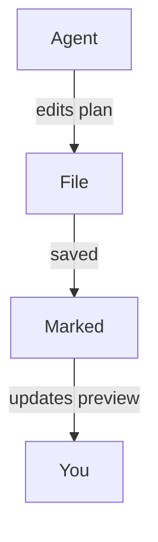

<!-- MT-DRAFT: machine translation; human review required -->

#
# <%= @title %>

Marked é um ótimo companheiro para fluxos de trabalho modernos de "codificação de agente", onde ferramentas de IA geram planos, refatoram código e atualizam a documentação enquanto você trabalha. Ao permitir que Marked observe seu projeto ou pastas de planejamento, você obtém uma visualização legível e ao vivo de tudo o que seus agentes de codificação tocarem em seguida, sem ter que procurar em seu editor ou árvore de arquivos.

## Observando seu projeto ou pasta de plano

Em vez de abrir um único arquivo, você pode apontar Marcado para uma pasta inteira que você usa para planos, notas de rascunho ou documentação gerada por IA:

- Mantenha uma pasta dedicada de “planos” ou “notas” em seu projeto.
- Configure seu agente de codificação (ou você mesmo) para salvar documentos de design, detalhamentos de tarefas e notas de status.
- Abra essa pasta em Marcado.

Assim que Marked estiver monitorando uma pasta, ele exibirá automaticamente o **arquivo modificado mais recentemente**. À medida que seu agente cria ou atualiza arquivos Markdown – seja um novo plano de implementação ou um log de progresso atualizado – o Marked muda para o documento novo ou alterado e atualiza a visualização instantaneamente.

Isso funciona especialmente bem com ferramentas de agente como Cursor, Claude e Copilot, que regeneram continuamente especificações, listas de tarefas ou notas de arquitetura enquanto você itera em um recurso.

## Rolando para a primeira alteração

Quando *Rolar para editar* está habilitado nas preferências do Marked, a visualização não apenas recarrega --- ela **rola diretamente para a primeira área alterada** do arquivo quando ele é atualizado.

Isso significa que você pode:

- Deixe seu assistente de IA reescrever seções de um plano ou documento de design.
- Assista Marked recarregar o arquivo assim que for salvo.
- Pouse automaticamente perto das primeiras linhas modificadas, em vez de procurar manualmente o que mudou.

Combinado com a observação de pastas, isso facilita ver exatamente o que seus agentes estão fazendo em seus documentos, mesmo quando fazem edições incrementais frequentes.

## Diagramas com Mermaid.js

Marked também tem **suporte a Mermaid.js habilitado por padrão**, portanto, diagramas de sequência, fluxogramas e diagramas de arquitetura que seus agentes geram usando blocos de código Mermaid serão renderizados de forma limpa na visualização. Quando seu assistente de IA gera código protegido como:

````

````

Marcado irá transformá-lo automaticamente em um diagrama interativo e estilizado, oferecendo uma visão visual de fluxos de trabalho complexos, fluxos de dados ou designs de sistema criados por ferramentas como Cursor, Claude, Copilot e outros assistentes de codificação de agentes.

## Exemplo de fluxos de trabalho de codificação agente

- **Cursor + Marcado**: Mantenha uma pasta `plans/` ou `notes/` em seu repositório onde o Cursor escreve planos de implementação passo a passo. Ponto marcado nessa pasta para sempre ver o plano mais recente, renderizado de forma limpa, conforme você aceita e aplica edições no editor.

- **Claude + Marcado**: Use Claude para gerar documentos de design, ADRs e planos de refatoração em uma pasta de projeto compartilhada. Marcado abre automaticamente a saída mais recente do Markdown para que você possa lê-la e anotá-la como uma especificação viva.

- **Copilot e outros assistentes de codificação de IA + Marked**: se você estiver usando GitHub Copilot, Copilot Workspace, ChatGPT ou outras ferramentas de agente que gravam Markdown, salvar sua saída em uma pasta monitorada oferece uma visualização sempre atualizada e de alta qualidade no Marked.

Ao combinar a observação de pastas com *Scroll to Edit*, o Marked transforma planos e notas gerados por IA em um centro de controle rápido e legível para suas sessões de codificação, especialmente quando você conta com fluxos de trabalho de agente e assistência contínua de ferramentas como Cursor, Claude e Copilot.